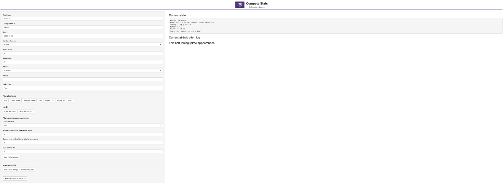

# Baseball Pitch Tracking App

An R Shiny application developed while working with Northwestern Baseball to support live pitch and plate appearance tracking during scrimmages.

## Project Overview

This application was built to make live pitching data collection during Northwestern Baseball scrimmages faster and more consistent.

Rather than manually organizing pitch information after a scrimmage, the app provides an interface for tracking each pitch and plate appearance as it happens while maintaining the current game state.

The resulting pitch-level data could then be exported and used as part of the team's internal pitching analysis and reporting workflow.

## Features

The application tracks:

- Pitcher
- Inning and half-inning
- Balls and strikes
- Outs
- Score
- Batter number
- Pitch number within each plate appearance
- Pitch result
- Plate appearance outcome
- Runs and earned runs

Pitch results can be entered using buttons for balls, called strikes, swinging strikes, fouls, balls in play, and hit-by-pitches.

The application also automatically handles game-state changes such as resetting the count after a plate appearance and advancing the half-inning after three outs.

## Live Data Collection

Each pitch is stored with the game situation that existed before the pitch, including the ball-strike count, pitcher, inning, batter, and pitch number.

Completed plate appearances are stored separately with their outcome, runs scored, earned runs, and outs recorded.

The application then combines the pitch-level and plate-appearance-level information into a structured CSV that can be used for downstream analysis.

## Error Correction

Because the application was designed for live use, functionality was included to correct data-entry mistakes without restarting the session.

Users can undo the most recently entered pitch or plate appearance, with the application restoring the relevant game state when possible.

## Baseball Analytics Workflow

The Shiny application was one, part of a larger pitching analytics workflow developed for Northwestern Baseball.

The full workflow included separate R code that processed the pitch and plate appearance data collected through the app, calculated traditional pitching statistics and staff-specific situational KPIs, and organized the results into reports used to evaluate pitcher performance.

The overall process was:

**Live Scrimmage → Pitch & PA Tracking → Structured Data Export → KPI Calculation → Pitching Reports**

This allowed data to be collected consistently during competition and then automatically transformed into information that could be used by the coaching staff to evaluate pitching performance.

## Internal KPI Reporting

In addition to developing the live tracking application, I worked on the R-based reporting process used to calculate and organize pitching KPIs from the collected data.

The reporting pipeline included both traditional pitching statistics and custom situational metrics designed around the staff's pitching philosophy and areas of emphasis.

Because those KPI definitions and reporting processes were developed for internal team use, the calculation and reporting code is not included in this public repository.

## Public Version

This repository contains a sanitized version of the live tracking application created for portfolio purposes.

Player names and other team-specific information have been removed from the public code. The screenshot above shows the original application interface used with Northwestern Baseball.

The separate R code used for internal KPI calculation and reporting has intentionally not been published. This repository is intended to demonstrate the data collection and application-development portion of the larger analytics workflow while respecting the confidentiality of team-specific processes and information.

## Tools Used

- R
- Shiny
- dplyr
- tibble
- Reactive programming
- Data collection and validation
- Data transformation
- CSV export

## Files

- `nu-pitch-tracking-app.R` — Sanitized public version of the live pitch tracking application
- `compete-stats-app.png` — Screenshot of the original application interface
